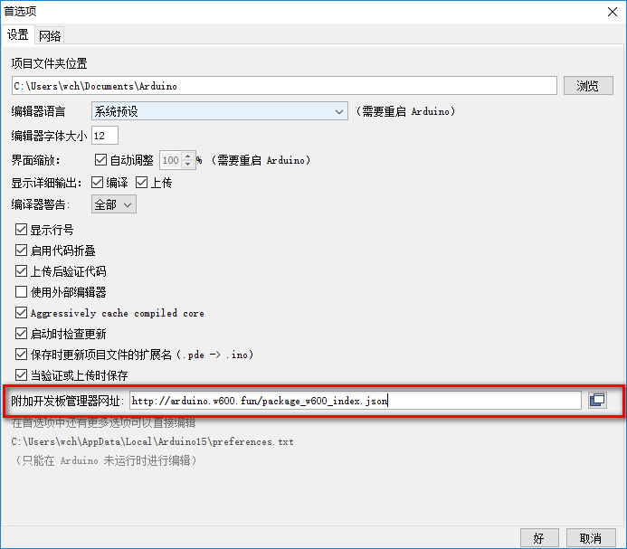
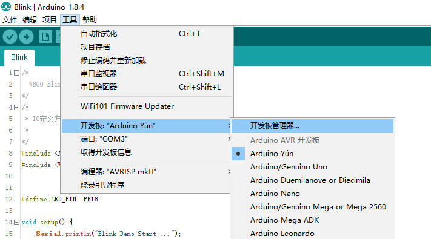
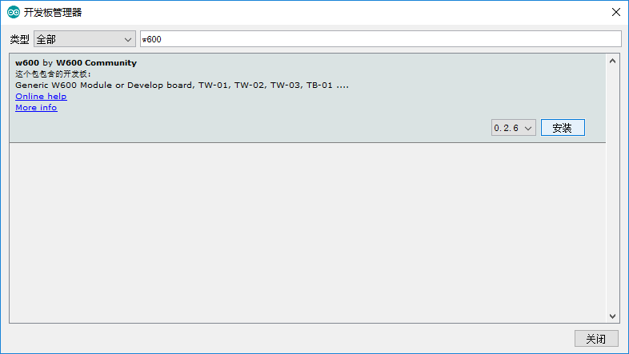
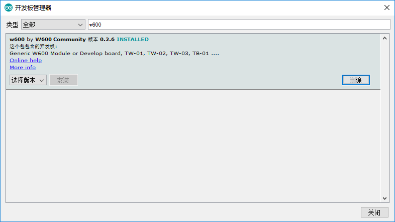
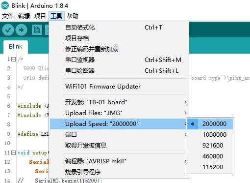
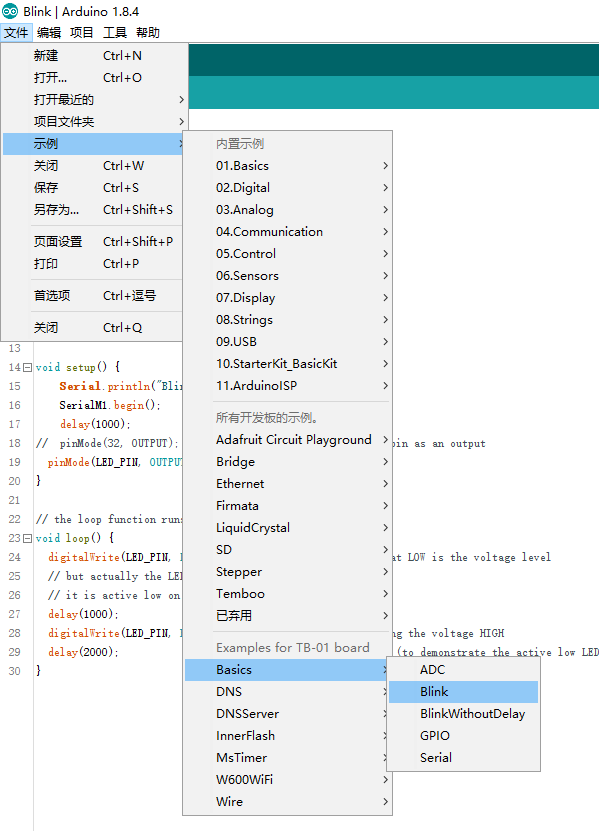
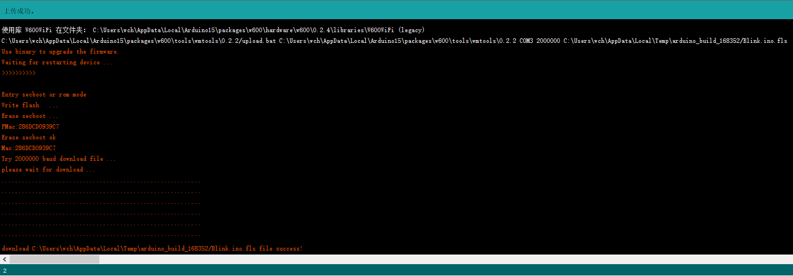
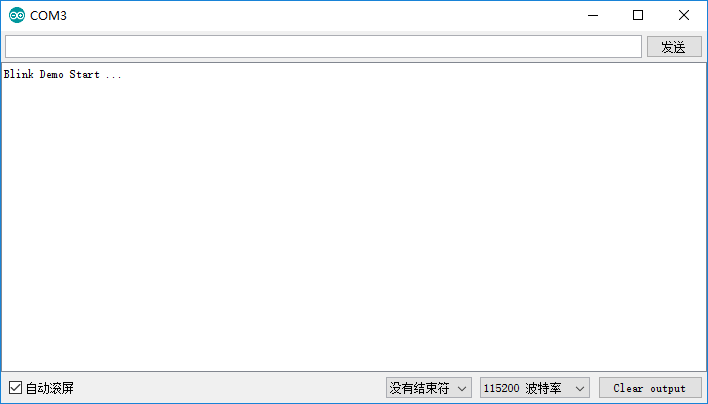

# W600 Arduino 入门指南

## 1.简介

[Arduino](https://baike.baidu.com/item/Arduino) 是一款便捷灵活、方便上手的开源电子原型平台。现在，W600芯片可以直接支持Arduino环境开发，开发者可以使用熟悉的Arduino函数和库编写代码，并直接在W600上面运行，无需外部微控制器。让开发者更便捷进行产品设计。

## 2.准备工作

-  1 x W600 开发板（推荐使用 [TB-01](http://shop.thingsturn.com)）
-  1 × Micro USB B 电缆
-  1 × PC（目前仅 Windows 环境可用）

## 3. 环境搭建

1. 通过 https://www.arduino.cc/en/Main/Software 下载 Arduino IDE 开发环境，建议使用最新版本。
2. 启动 Arduino，并打开“首选项”窗口。在附加开发板管理器网址中添加`http://download.thingsturn.com/arduino/stable/package_w600_index.json`

3. 打开菜单【工具】-》【开发板】-》【开发板管理器】

4. 在输入框中填入关键词 `w600` 选择最新版本（`当前为0.2.4`）,点击【安装】

5. 选择 TB-01 开发板 ，并配置开发板参数（注意选择正确的通信端口以及速率）
 

**端口：**可查看电脑设备管理器进行对应

**Upload Speed：**烧录时的通信速率，默认为2Mbps，如果下载失败可选择115200。

**Upload Files：**下载文件格式（默认为IMG，如果下载失败或需要更新secboot，可选择FLS）

 

6. 选择【文件】-》【示例】，可以尝试一些示例进行烧录测试，如【Blink】

   

7. 点击Upload 进行固件下载

      

8.  运行后效果如下

​	同时，可以看到开发板上面的指示灯在不停的闪烁。

## 4 其他

有任何疑问和建议，可咨询 support@thingsturn.com 或加QQ群 86032006 沟通。